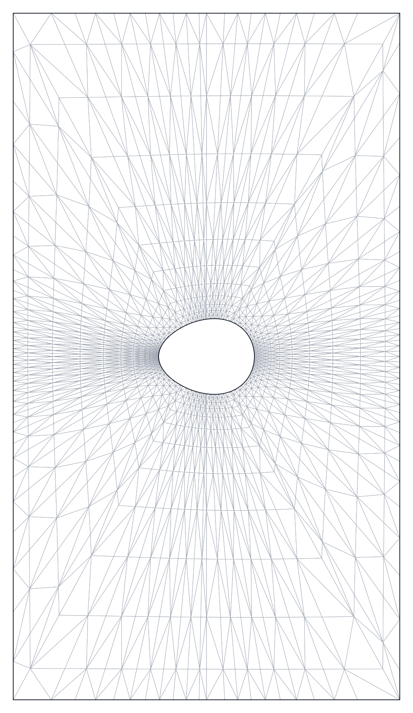
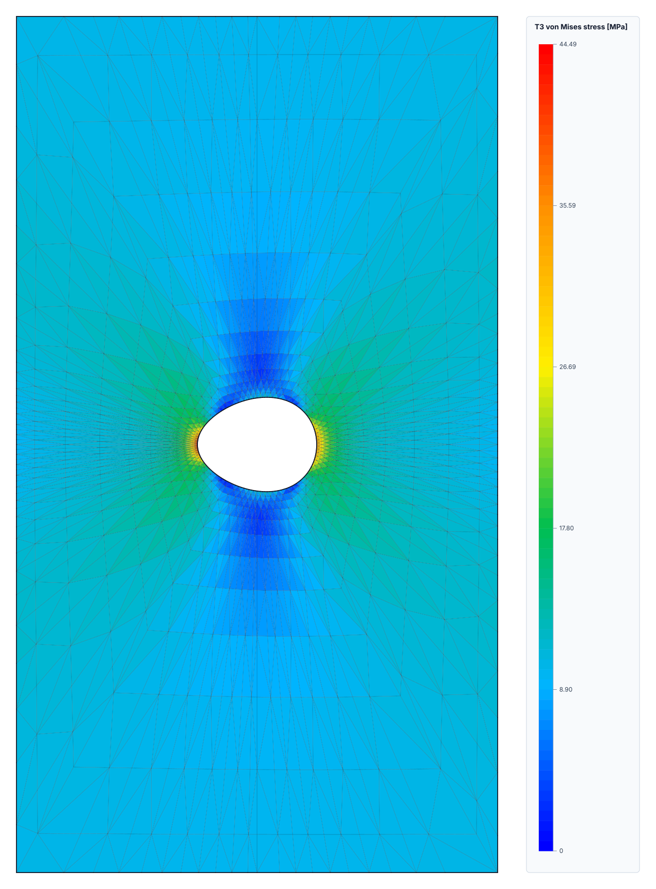

# RustyFEM

RustyFEM is a finite element method solver written in Rust. The
current implementation focuses on static 2D analysis and keeps the numerical
steps visible: element matrices, global assembly, constraints, loads, solving,
and postprocessing.

## Documentation

RustyFEM currently implements six 2D finite elements:

- 2D truss
- 2D Euler-Bernoulli beam
- Plane-stress T3 triangle
- Plane-stress T6 quadratic triangle
- Plane-stress Q4 quadrilateral
- Plane-stress Q8 serendipity quadrilateral

The [engineering assumptions](docs/engineering-assumptions.md) document
explains the material model, static analysis assumptions, degrees of freedom,
and limitations of each formulation. Continue there to understand what the
solver represents mechanically before reading the implementation.

The examples below show the theory in action: a beam is compared with analytical formulas for its deflection and bending moment,
while a sequence of progressively finer triangular meshes demonstrates how the numerical solution converges toward an analytical solution.

## Requirements

- Rust 1.89 or newer
- Cargo

## Run The Interactive Solver

Start a 2D interactive session with:

```bash
cargo run -- --space 2d
```

The dense LU solver is used by default. Use the sparse CSR solver with
preconditioned Conjugate Gradient:

```bash
cargo run -- --space 2d --solver sparse \
  --cg-tolerance 1e-10 \
  --cg-max-iterations 1000
```

The program reads materials, sections, nodes, constraints, elements, and loads.
Loads can be entered as nodal loads, uniform line loads on beam elements, edge
tractions on plane-stress elements, body forces on plane-stress elements, or
self-weight on plane-stress elements.
Enter `done` at the end of each group.

## Beam Example

The following example is a cantilever beam with:

- length `L = 1 m`
- Young's modulus `E = 200 Pa`
- density `rho = 1 kg/m^3`
- cross-sectional area `A = 1 m^2`
- second moment of area `I = 2 m^4`
- section height `h = 2 m`
- downward tip load `P = -12 N`
- the first node fully fixed

The beam section and element input formats are:

```text
section> beam ID AREA I HEIGHT
element> beam ID NODE_1 NODE_2 MATERIAL_ID SECTION_ID
```

During the session, the program asks you to provide the model in several
groups. You must enter:

- material properties: Young's modulus, Poisson's ratio, and density;
- nodes: node ID and `x`, `y` coordinates;
- constraints: node ID, degree of freedom (`Ux`, `Uy`, or `Rz`), and prescribed displacement;
- sections: section type, section ID, and section properties;
- elements: element type, connectivity, material ID, and section ID;
- loads: nodal loads or supported element loads.

Enter `done` after each group to continue to the next prompt. For this beam,
the interactive session looks like this:

```text
material> 1 200 0.3 1
material> done
section> beam 2 1 2 2
section> done
node> 1 0 0
node> 2 1 0
node> done
constraint> 1 Ux 0
constraint> 1 Uy 0
constraint> 1 Rz 0
constraint> done
element> beam 10 1 2 1 2
element> done
load> 2 Uy -12
load> done
```

Plane-stress Q4 and Q8 quadrilaterals can be entered with nodes ordered
counterclockwise around the element:

```text
q4 ID NODE_1 NODE_2 NODE_3 NODE_4 MATERIAL_ID SECTION_ID
q8 ID NODE_1 NODE_2 NODE_3 NODE_4 NODE_5 NODE_6 NODE_7 NODE_8 MATERIAL_ID SECTION_ID
t6 ID NODE_1 NODE_2 NODE_3 NODE_4 NODE_5 NODE_6 MATERIAL_ID SECTION_ID
```

The Q4 corner order is bottom-left, bottom-right, top-right, top-left in the
reference square. Q8 uses the same four corners followed by the midside nodes:
bottom, right, top, left. T6 uses three triangle corners followed by midside
nodes on edges `1-2`, `2-3`, and `3-1`. The solver rejects inverted or
degenerate higher-order plane-stress elements by checking the Jacobian
determinant at the element integration points.

For a cantilever with a point load at the free end, the analytical solution is:

```text
v(L)     = P L^3 / (3 E I) = -0.010 m
theta(L) = P L^2 / (2 E I) = -0.015 rad
```

The numerical beam result agrees with the analytical values to within machine precision (floating-point round-off).

The recovered bending moment and fiber stress also agree with the analytical
relations:

```text
M(x)       = P (L - x)       N m
kappa(x)  = M(x) / (E I)     1/m
sigma(y)  = N / A - M(x) y / I Pa
```

At the fixed end, `M(0) = -12 N m` and `y = +/- h/2 = +/- 1 m`, so the
recovered fiber stresses are `+6 Pa` and `-6 Pa`.

## Uniform Beam Line Loads

Uniform line loads can be applied to beam elements with:

```text
beam_uniform ELEMENT_ID local|global QX QY
```

`QX` and `QY` are force per unit beam length. With `local`, `QX` acts along the
beam axis and `QY` acts in the local transverse direction. With `global`, the
components are interpreted in the model x/y axes and transformed to the beam's
local axes during load-vector assembly.

For the beam example above, a downward uniform local load of `-12 N/m` is:

```text
load> beam_uniform 10 local 0 -12
```

The solver converts this load into the consistent equivalent nodal load vector.
Beam end-force and section-response recovery also include the fixed-end force
contribution from the uniform load.

## Plane-Stress Edge Tractions

Uniform tractions can be applied to one edge of a T3, Q4, or Q8 plane-stress element with:

```text
edge_traction ELEMENT_ID NODE_A NODE_B local|global TX TY
```

`NODE_A` and `NODE_B` must be the two corner nodes of one boundary edge of the
selected element. `TX` and `TY` are force per unit area. The solver multiplies
them by the plane-stress thickness and edge length, then converts the traction
to consistent nodal forces on that edge.

With `global`, the components are interpreted in the model x/y axes. With
`local`, `TX` acts from `NODE_A` toward `NODE_B`, and `TY` acts in the edge
normal direction.

For example, this applies a downward global traction on edge `2-3` of element
`20`:

```text
load> edge_traction 20 2 3 global 0 -1000
```

## Plane-Stress Body Forces

Uniform body forces can be applied over the full area and thickness of a T3,
Q4, or Q8 plane-stress element with:

```text
body_force ELEMENT_ID global BX BY
```

`BX` and `BY` are force per unit volume in the model x/y axes. The solver
multiplies them by the element area and plane-stress thickness, then converts
the result to consistent nodal loads for the selected interpolation.

For example, this applies a downward body force to plane-stress element `20`:

```text
load> body_force 20 global 0 -9810
```

This is an explicitly supplied body-force intensity. Use `self_weight` when the
load should be calculated from material density.

## Plane-Stress Self-Weight Loads

Self-weight loads can be applied over the full area and thickness of a T3, Q4,
or Q8 plane-stress element with:

```text
self_weight ELEMENT_ID global AX AY
```

`AX` and `AY` are acceleration components in the model x/y axes. The solver
multiplies them by the element material density, area, and plane-stress
thickness, then converts the result to consistent nodal loads for the selected
interpolation.

For example, this applies gravity in the negative global y direction:

```text
load> self_weight 20 global 0 -9.81
```

## T3 Triangle Mesh Benchmark

The T3 benchmark models a rectangular plane-stress cantilever:

- rectangle dimensions: `L = 10 m`, `H = 1 m`
- thickness: `t = 1 m`
- material: `E = 1000 Pa`, `nu = 0.3 [-]`
- left edge: `Ux = Uy = 0`
- total downward load on the right edge: `P = -1 N`
- every rectangular cell is split into two T3 triangles

For comparison, the Euler-Bernoulli beam reference uses:

```text
I = t H^3 / 12 = 1/12 m^4
delta_analytical = P L^3 / (3 E I) = -4.0 m
```

The measured displacement is the vertical displacement of the middle node on
the right edge and is reported in `m`. The table shows convergence as the
triangular mesh is refined. Relative error is shown as a
percentage.
The dimensions in the first column are the number of rectangular cells in the
`x` and `y` directions; each cell contains two T3 elements.

| Mesh | Numerical displacement [m] | Analytical displacement [m] | Relative error |
| --- | ---: | ---: | ---: |
| `4x2` | `-0.473706556570` | `-4.000000000000` | `88.1573%` |
| `8x4` | `-1.371713039702` | `-4.000000000000` | `65.7072%` |
| `16x8` | `-2.700297683096` | `-4.000000000000` | `32.4926%` |
| `32x16` | `-3.579778463598` | `-4.000000000000` | `10.5055%` |
| `64x32` | `-3.901091199391` | `-4.000000000000` | `2.4727%` |

### T3 vs Q4 vs Q8 on the same grid

The comparison below uses the same rectangular domain, supports, material,
thickness, and right-edge traction for all three element families. T3 splits
each rectangular cell into two triangles; Q4 uses one bilinear quadrilateral
per cell; Q8 uses one serendipity quadrilateral with midside nodes and no
center node. The measured displacement is still the vertical displacement of
the middle node on the right edge.

| Mesh | T3 elements | Q4/Q8 elements | T3/Q4 DOF | Q8 DOF | T3 displacement [m] | T3 error | Q4 displacement [m] | Q4 error | Q8 displacement [m] | Q8 error |
| --- | ---: | ---: | ---: | ---: | ---: | ---: | ---: | ---: | ---: | ---: |
| `4x2` | `16` | `8` | `30` | `74` | `-0.473711211345` | `88.1572%` | `-1.169373245606` | `70.7657%` | `-3.966123966675` | `0.8469%` |
| `8x4` | `64` | `32` | `90` | `242` | `-1.371713687354` | `65.7072%` | `-2.491615511212` | `37.7096%` | `-4.009297426230` | `0.2324%` |
| `16x8` | `256` | `128` | `306` | `866` | `-2.700301359137` | `32.4925%` | `-3.482663888378` | `12.9334%` | `-4.019288746216` | `0.4822%` |
| `32x64` | `4096` | `2048` | `4290` | `12674` | `-3.606584081895` | `9.8354%` | `-3.872694011611` | `3.1826%` | `-4.022563262119` | `0.5641%` |

The same benchmark also compares the maximum recovered von Mises stress over
all plane-stress elements. T3 stress is constant inside each element. Q4 and
Q8 are reported from their Gauss integration points.

The Euler-Bernoulli stress reference uses the maximum bending moment at the
fixed end:

```text
M_max = |P| L = 10 N m
sigma_max = M_max (H / 2) / I = 60 Pa
von_mises_max = |sigma_max| = 60 Pa
```

At the outer fiber where bending stress is maximal, the rectangular-section
shear stress is zero, so the plane-stress von Mises value is equal to the
absolute bending stress.

| Mesh | Analytical max VM [Pa] | T3 max VM [Pa] | T3 error | Q4 GAUSS max VM [Pa] | Q4 GAUSS error | Q8 GAUSS max VM [Pa] | Q8 GAUSS error |
| --- | ---: | ---: | ---: | ---: | ---: | ---: | ---: |
| `4x2` | `60.000000000000` | `13.027176002841` | `78.2880%` | `20.145714117689` | `66.4238%` | `47.041855387056` | `21.5969%` |
| `8x4` | `60.000000000000` | `25.515325713580` | `57.4745%` | `35.328832673177` | `41.1186%` | `52.689192334254` | `12.1847%` |
| `16x8` | `60.000000000000` | `41.835587401302` | `30.2740%` | `48.231110614785` | `19.6148%` | `56.584575041251` | `5.6924%` |
| `32x64` | `60.000000000000` | `53.829101333876` | `10.2848%` | `56.718072387998` | `5.4699%` | `62.895792074648` | `4.8263%` |

The regular comparison test covers the first three rows for both displacement
and stress:

```bash
cargo test t3_q4_q8_cantilever_response_comparison_across_meshes -- --nocapture
```

The `32x64` row is generated with an ignored sparse benchmark. It is much
larger, so `--release` is recommended:

```bash
cargo test --release t3_q4_q8_cantilever_32x64_sparse_edge_load_comparison -- --ignored --nocapture
```

## Plate Stress Concentration Benchmark

The plate benchmark models the tensile specimen with an asymmetric central
notch:

- plate dimensions: `b = 484 mm`, `h = 860 mm`
- thickness: `t = 3 mm`
- material: `E = 70000 MPa`, `nu = 0.34 [-]`
- weakened-section width: `b - 2a = 364 mm`, with `a = 60 mm`
- sharper left notch: `A`, `r = 25 mm`
- smoother right notch: `B`, `r = 50 mm`
- load: `1500 kg` equally distributed across upper and lower edges. The plate is being stretched.

| Notch | Strain-gauge `sigma_y` [MPa] | Experimental `alpha_k` | Theoretical `alpha_k` |
| --- | ---: | ---: | ---: |
| `A`, `r=25 mm` | `42.95` | `3.19` | `3.20` |
| `B`, `r=50 mm` | `35.12` | `2.61` | `2.60` |



**T3 von Mises**



**T6 von Mises**


The measured quantity is the local `sigma_y` at the notch roots:

```text
alpha_k = sigma_y(root) / sigma_nom
sigma_nom = P / ((b - 2a) t)
```

Generate only the T3 mesh SVG with:

```bash
cargo bench --bench plate_stress_concentration -- --t3-mesh-only
```

Run the sparse T3 benchmark and regenerate all result SVGs with:

```bash
cargo bench --bench plate_stress_concentration -- --t3
```

Run the sparse T3/T6 von Mises comparison with:

```bash
cargo bench --bench plate_stress_concentration -- --t3-t6
```

The SVG outputs and point-sampling CSV are collected in
`target/plate_stress_concentration/`.

The current T3/T6 comparison result for the `1500 kg` case is:

| Element | Elements | Nodes | A/R25 `sigma_y` [MPa] | A/R25 error | A/R25 `alpha_k` | B/R50 `sigma_y` [MPa] | B/R50 error | B/R50 `alpha_k` | Max von Mises [MPa] | CG iterations | Relative residual |
| --- | ---: | ---: | ---: | ---: | ---: | ---: | ---: | ---: | ---: | ---: | ---: |
| T3 | `3072` | `1664` | `44.334354` | `+3.22%` | `3.290052` | `34.560133` | `-1.59%` | `2.564707` | `43.216949` | `758` | `9.859e-7` |
| T6 | `3072` | `6400` | `44.607508` | `+3.86%` | `3.310323` | `34.801872` | `-0.91%` | `2.582647` | `44.489560` | `1876` | `9.997e-7` |

The benchmark also samples data from points where strain gauges where placed in expetiments. Results:

| Notch | Distance from notch [mm] | Strain-gauge `epsilon_x` [‰] | T6 `epsilon_x` [‰] | `epsilon_x` error | Strain-gauge `epsilon_y` [‰] | T6 `epsilon_y` [‰] | `epsilon_y` error |
| --- | ---: | ---: | ---: | ---: | ---: | ---: | ---: |
| A/R25 | `4` | `-0.104` | `-0.099` | `+5.08%` | `0.487` | `0.448` | `-8.10%` |
| A/R25 | `14` | `-0.017` | `-0.014` | `+16.55%` | `0.326` | `0.268` | `-17.81%` |
| A/R25 | `24` | `-0.006` | `-0.005` | `+20.18%` | `0.248` | `0.218` | `-12.03%` |
| A/R25 | `44` | `-0.017` | `-0.013` | `+23.23%` | `0.205` | `0.179` | `-12.84%` |
| A/R25 | `80` | `-0.035` | `-0.031` | `+10.18%` | `0.188` | `0.161` | `-14.21%` |
| A/R25 | `134` | `-0.052` | `-0.046` | `+10.86%` | `0.173` | `0.154` | `-11.15%` |
| A/R25 | `174` | `-0.030` | `-0.047` | `-56.24%` | `0.162` | `0.139` | `-14.27%` |
| B/R50 | `4` | `-0.115` | `-0.112` | `+2.78%` | `0.437` | `0.407` | `-6.84%` |
| B/R50 | `14` | `-0.047` | `-0.043` | `+8.60%` | `0.328` | `0.279` | `-15.01%` |
| B/R50 | `24` | `-0.028` | `-0.024` | `+13.02%` | `0.263` | `0.229` | `-12.92%` |
| B/R50 | `44` | `-0.012` | `-0.021` | `-73.38%` | `0.221` | `0.184` | `-16.54%` |
| B/R50 | `80` | `-0.035` | `-0.033` | `+4.61%` | `0.194` | `0.163` | `-15.95%` |
| B/R50 | `134` | `-0.048` | `-0.047` | `+2.58%` | `0.181` | `0.154` | `-14.74%` |
| B/R50 | `174` | `-0.049` | `-0.047` | `+3.83%` | `0.140` | `0.140` | `-0.33%` |

For the dominant `epsilon_y` measurement, the mean absolute T6 point-sampling
error is approximately `12.3%`.

## Dense vs Sparse Solver Benchmark

The same rectangular T3 cantilever models were solved with both the dense LU
solver and the sparse CSR solver using preconditioned Conjugate Gradient with
the Jacobi preconditioner. The measurements include stiffness assembly,
boundary-condition application, and the complete linear solve.

Benchmark command:

```bash
cargo bench --bench solver_benchmark -- \
  --sample-size 100 \
  --measurement-time 5 \
  --warm-up-time 5
```

Results were collected with Criterion in release mode. The values below are
the median time reported by Criterion on the benchmark machine.

| Mesh | Dense LU | Sparse PCG + Jacobi | Relative speed |
| --- | ---: | ---: | ---: |
| `4x2` | `11.777 us` | `25.990 us` | `0.45x` |
| `8x4` | `85.919 us` | `147.440 us` | `0.58x` |
| `16x8` | `2.1291 ms` | `977.280 us` | `2.18x` |
| `32x16` | `90.172 ms` | `8.0671 ms` | `11.18x` |
| `64x32` | `6.5227 s` | `79.985 ms` | `81.55x` |

The sparse solver is slower for small systems because COO/CSR assembly and
iterative-solver setup add fixed overhead. Starting at `16x8`, the reduced
storage and sparse matrix-vector products outweigh that overhead. For the
`64x32` mesh, the sparse solver is approximately 82 times faster than dense
LU. The largest dense measurements exceeded Criterion's five-second target
budget, but all configured samples were collected.

## Development Checks

Run the standard checks before committing changes:

```bash
cargo fmt --check
cargo clippy --all-targets --all-features -- -D warnings
cargo test
```
